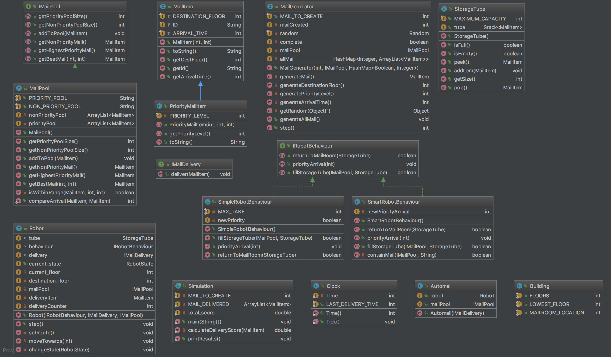

## <center>  Design Analysis Report </center>
######  <center> Project Group 16 </center>
<center> Shuyuan Dang 840992 </center>

<center> Feng Zhao 838219</center>

<center> Hongyi Chen 822666</center>


- **Introduction**
 This program mainly provide an simulation of AutoMail bot system. However，the modeling of program, that is, association among classes have some shortcomings, as a result, the coupling among classes is high and cohesion within each class is low. We will focus on GRASP patterns to analyze the whole program starting from the reponsibility of each class, to association between classes.

- **Responsibilities of each class**
    - _ExcessiveDeliveryException_, _MailAlreadyDeliveredException_, _TubeFullException_, _Building_, _Clock_
    These 5 classes will not be analyzed because these are error exceptions, static variable carrier which will not affect the design of program.

    - _Simulation_
    This class works as a controller with a main function, which means it is also a driver of the whole program. It is also a creator with the creation of many objects, such as _Automail_, _MailGenerator_. However, _ReportDelivery_ class implementing IMailDelivery interface is defined in this class, which will increase the coupling by using variables of _Simulation_ class and reduce the cohesion because _ReportDelivery_ describes the behaviour of delivery,
    which is an individual further extendible function. Furthermore, the function calculateDeliveryScore should be extracted from _Simulation_ because it describes the behaviour of calculation of the score representing the usability of system.

    - _MailGenerator_
      This class works as an information expert with high cohesion and creator to create _MailItem_.

    - _Robot_
      This class works as information expert, major in describing the behaviour of Robot. This class include a state machine, describing different triggers for different actions. It receives several parameters, such as _ReportDelivery_, _IMailPool_ and _IRobotBehaviour_ to initialize.

    - _StorageTube_
      This class describes the storagetube carried by robot, and works as an information expert. However, it has default max capacity which do not correspond to different robot behaviour very well. This class is mainly created and used in Robot, which describes a default storagetube.

    - _Automail_
    This class works as creator, which creates three objects of class: _IMailPool_, _IRobotBehaviour_, and _Robot_. Automail act as a core product of this extendible system. It increase the coupling between classes, however, we plan not to remove this class because it eahance integrity of strategies package which is further modifiable and build indirection with Simulation class, working as an information expert as well. However, _Robot_ should not be created here because it belongs to automail package, which is not further extendible. This will increase the coupling between packages.

    - _MailPool_, _IMailPool_
    MailPool, working as an information expert, implements IMailPool interface which is also further extendible. Although there exists 2 classes in MailPool class, named PriorityComparer and NonPriorityComparer, these 2 classes are only used in MailPool which increase cohesion of _MailPool_.

    - _SimpleRobotBehaviour_, _SmartRobotBehaviour_, _IRobotBehaviour_
    This 2 classes and 1 interface describes two different behaviours of robot implementing interface IRobotBehaviour which is further modifiable and it is good to create these behaviours in _Automail_ class.

    - _MailItem_
    This class describes a new unit used in this program. _MailItem_ is widely use in nearly all other classes. _PriorityMailItem_ extends _MailItem_, with more features, such as priority level. It is worth noting that the variables in MailItem are protected, which should be changed to private to make MailItem encapsulated.

- **Association**
  In this section, the shortcoming of the program related to association between classes will be discussed.
  - _Automail_ should not create _Robot_ class because it is inappropriate for  unextendible _Robot_ class in _Automail_ class which also include other extendible classes and will increase coupling between packages.

  - _Automail_ class, as an integration of strategies package, should receive a key from driver class, and return corresponding behaviour. This kind of design will reduce coupling between classes and increase cohesion within Automail, which can also provide more complete function.

  - _Simulation_ class should create and pass needed parameters to _Robot_ class, which follow certain robot _behaviour_. It will increase package coupling if robot is created in _Automail_.

  - _ReportDelivery_ implementing _IMailDelivery_ is defined in _Simulation_ class, however, it is passed as parameters to create _Automail_ class, further used to create _Robot_ class, which increase coupling and reduce cohesion of _Simulation_ and _Automail_ class.

  - In _Simulation_ class, continuous object calling using "." will greatly increase coupling among classes, for example
  ```
    if (priority > 0) automail.robot.behaviour.priorityArrival(priority);
  ```

  Because of the excessively large size of the picture, the class details and association within design model are seperated.

  The design model class details of given program are shown below.
 <div align ="center">
 
 </div>


  The design model associations of given program are shown in below.
 <div align ="center">
 
 </div>
